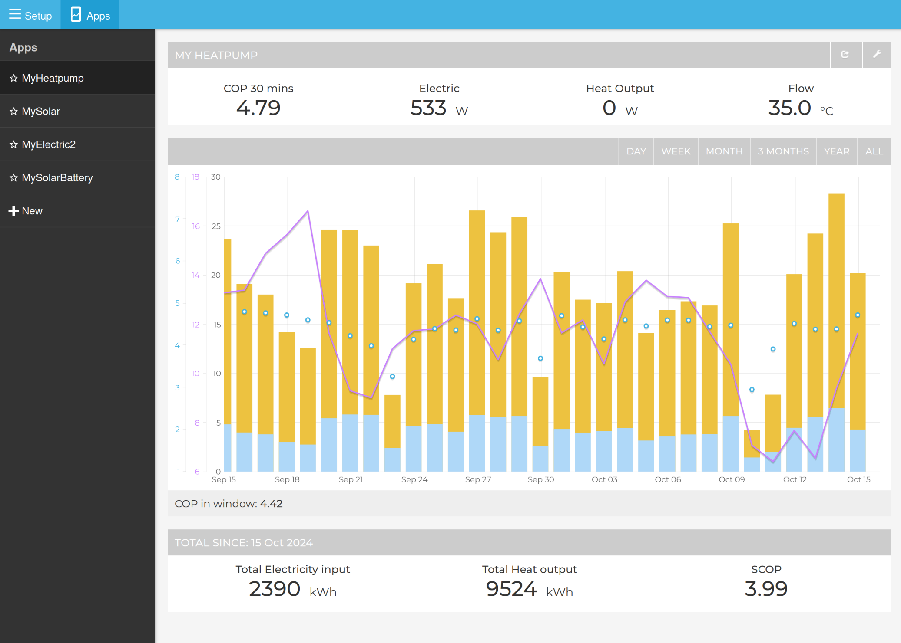
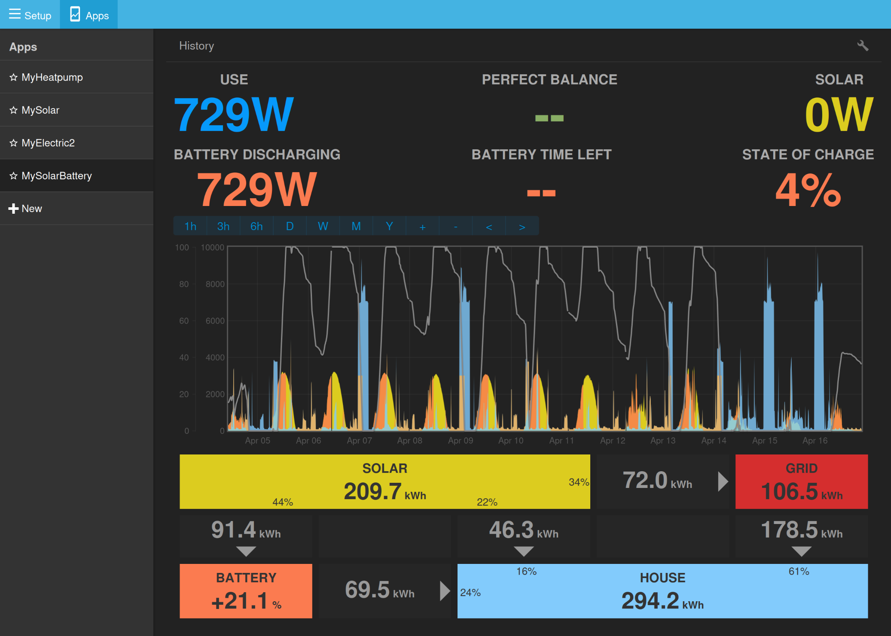
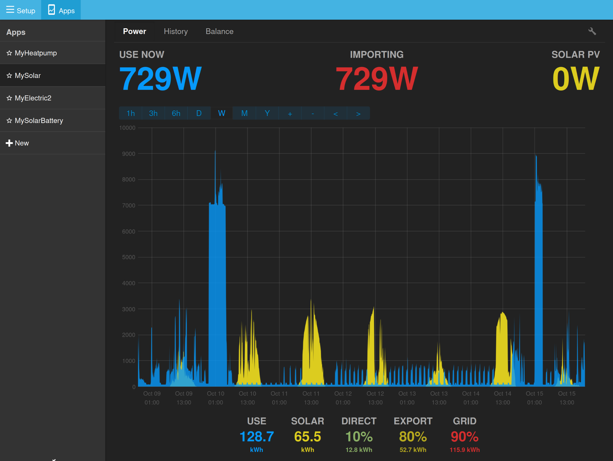

# Emoncms: Test environment dataset

A heatpump, solar and home electric use dataset for aiding with Emoncms and HeatpumpMonitor.org application development.

- Base period for dataset: **01-10-2024** to **01-10-2025**.
- Scripts here can be used to transpose this dataset to last 365 day period.
- Battery, grid import/export data and kWh data can be generated from this base power data set.

## Dataset in Action

The test dataset enables full functionality testing of Emoncms applications:

**MyHeatpump App** - The My Heatpump app can be used to explore the performance of a heatpump including, electricity consumption, heat output, COP and system temperatures.



**MySolar Battery App** - This app can be used to explore onsite solar generation, self consumption, battery integration, export and building consumption.



**MySolar App** - The My Solar app can be used to explore onsite solar generation, self consumption, export and building consumption both in realtime with a moving power graph view and historically with a daily and monthly bargraph.



## Setup Instructions

### 1. Extract the dataset
First, unzip the phpfina data files:
```bash
unzip phpfina.zip
```

### 2. Create settings.php 
Copy example.settings.php over to settings.php. Change the userid as required!
```bash
sudo cp scripts/example.settings.php scripts/settings.php
```

### 3. Add feeds to account
Run the script to add the base feeds to your Emoncms account (re-run the script to update latest data - simulates live data based on round robin approach).
```bash
sudo php scripts/add_feeds_to_account.php
```

This script creates feeds from the phpfina dataset files. The following feeds are available in the phpfina folder:

**Heat pump monitoring feeds:**
- **heatpump_elec** - Heat pump electrical consumption (W)
- **heatpump_heat** - Heat pump heat output (W)
- **heatpump_flowT** - Heat pump flow temperature (°C)
- **heatpump_returnT** - Heat pump return temperature (°C)
- **heatpump_flowrate** - Heat pump water flowrate (L/min)
- **heatpump_dhwT** - Hot water cylinder temperature (°C)
- **heatpump_roomT** - Indoor room temperature (°C)
- **heatpump_outsideT** - Outside air temperature (°C)

**Electrical consumption feeds:**
- **power_appliances** - Appliances electrical consumption (W)
- **power_car** - Electric vehicle charging consumption (W)
- **power_cooker** - Cooker consumption (W)
- **power_heatpump** - Heat pump electrical consumption (W)
- **power_lighting** - Lighting consumption (W)

**Solar generation:**
- **solar** - Solar PV generation (W)

### 4. Post-processing
Run the post-processing script to generate additional calculated feeds:
```bash
sudo php scripts/post_process.php
```

This script performs three main operations:

#### Formula-based feeds:
- **use** - Total home electrical consumption (W, calculated as sum of power_appliances + power_lighting + power_cooker + power_heatpump + power_car)

#### Power-to-kWh conversion feeds:
The script converts all power feeds to cumulative kWh feeds:
- **heatpump_elec_kwh** - Heat pump electrical consumption (kWh, cumulative)
- **heatpump_heat_kwh** - Heat pump heat output (kWh, cumulative)
- **power_appliances_kwh** - Appliances consumption (kWh, cumulative)
- **power_car_kwh** - Car charging consumption (kWh, cumulative)
- **power_cooker_kwh** - Cooker consumption (kWh, cumulative)
- **power_heatpump_kwh** - Heat pump consumption (kWh, cumulative)
- **power_lighting_kwh** - Lighting consumption (kWh, cumulative)
- **solar_kwh** - Solar PV generation (kWh, cumulative)
- **use_kwh** - Total home electrical consumption (kWh, cumulative)

#### Battery simulator feeds:
The script runs a battery simulator (9.5kWh capacity, 3kW charge/discharge rate) that creates:
- **battery_charge** - Battery charging power (W)
- **battery_discharge** - Battery discharging power (W)
- **battery_soc** - Battery state of charge (%)
- **import** - Grid import power after battery optimization (W)
- **battery_charge_kwh** - Battery charging energy (kWh, cumulative)
- **battery_discharge_kwh** - Battery discharging energy (kWh, cumulative)
- **import_kwh** - Grid import energy after battery optimization (kWh, cumulative)
- **solar_direct_kwh** - Solar energy used directly (kWh, cumulative)

